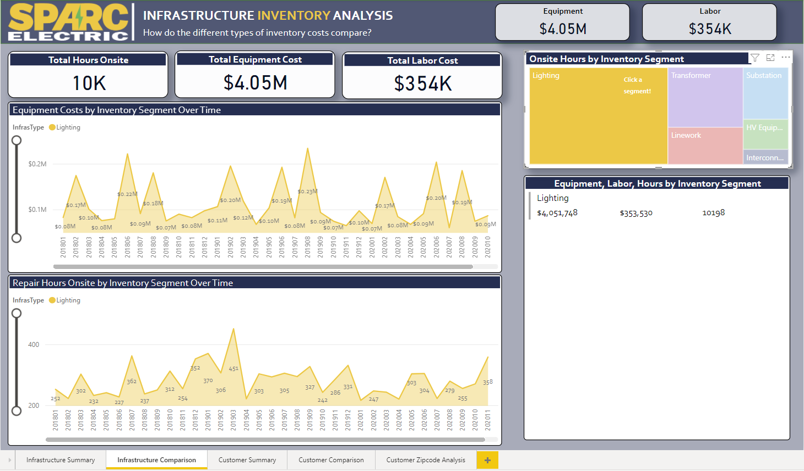
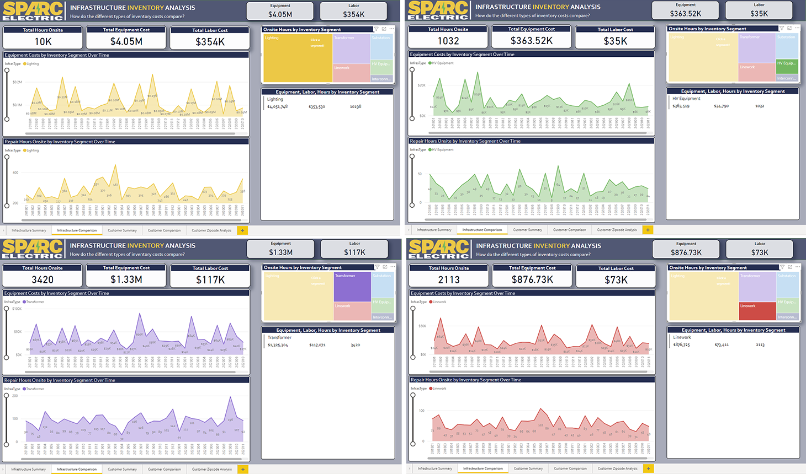

[Go To Technical and Entity Information](technical.md)   
[How the SparcElectric Test-bed was Generated](steps_to_build.md)  

---  
## SparcElectric Mixed Workload Database   and Data Warehouse Test-bed
---  

### The Scenario
SparcElectric, a fictitious small electric power supplier, serves seven locations (six in Virginia and one in Maryland).  Their customers consist of residential and commercial clients – as well as several industrial, city, and county government entities.

To serve their customers and track the operations of their business, SparcElectric employs a mixed workload database – also referred to as a hybrid data warehouse model – which allows them to run OLTP and OLAP workload processing side-by-side. This combined database/data warehouse provides the ability to capture data inserts and updates through transactions, and also perform analytics.

Anticipating an increase in workload due to various acquisitions, SparcElectric is moving a portion of their operations to the cloud. They foresee a large increase to their current customer base and anticipate either complete re-platforming or cloud hybridizing their data environment during their modernization and expansion efforts.

### First Objectives:
- Create the on-premise mixed workload (OLTP + OLAP) database/data warehouse environment.
- Simulate SparcElectric's mixed workload on-premise data warehouse – the data mart for the operations side of their enterprise responsible for the SparcElectric fleet, representing its service to its customers and its internal infrastructure through work orders.
- Create visualizations to pull from the data and display insights.
- Simulate the metering and electric delivery to SparcElectric's customers.
- Transition one or more segments to the cloud (as a hybrid, augmented, or distributed data architecture) as an exercise in re-platforming and modernizing a data environment.
- Demonstrate the necessary changes as SparcElectric transitions some or all of its processing to the cloud.
- Retain all version of the necessary code and insights as a resource.

### Power BI Insights for SparcElectric
> Leadership at SparcElectric utilizes on-demand data visualizations of Power BI to provide the following insights:

> What is the balance between SparcElectric's different customer segments in the customer work orders? (residential, commercial, and government accounts).
> And what is the cost of each of those different segments in labor and equipment?

The above are addressed by the following dashboard:

> How much time is being spent on-site for each customer segment?

The next two dashboards hold both on-site hours and equipment cost, slicing the Repair Hours Onsite by the Connection Classification (Customer segment): City/Town govt., County govt., State govt., Federal govt., and Commercial or Residential. 

The second dashboard shows the breakdown of costs, both labor and equipment by both Customer zipcode and Employee zipcode, along with the total onsite hours.

 

> How much time is being spent on-site for SparcElectric's infrastructure tickets? 

The dashboard below shows the onsite repair hours along with the equipment costs, sliced by the inventory segments by infrastructure type: High Voltage equipment, Interconnects, Lighting (street lights), Linework, Substation equipment, and Transformers.

> What inventory segment (street lights, transformers, power lines, etc.) is SparcElectric spending the most on for internal maintenance and repairs?

Lighting ends up being the largest spend, due to the random nature of the equipment charges,  the labor hours required, and the fact that streetlights are the largest segment of equipment the company owns / operates.

> What is the breakdown between SparcElectric's equipment and labor costs in infrastructure and inventory? 

### Technical Choices (Overview)
- Platform: Microsoft SQL Server on-prem database, SSMS, SSIS, and Power BI.
- Data: Work order data is randomized between two limits; a min and max for customer related labor and equipment costs that varies over time, and a min and max for infrastructure related labor and equipment costs that varies over the same time period.

### Additional Warning
- None of the code in the SparcElectric Mixed Database and Data Warehouse Test-bed is production ready and should not be run against a production instance. 
- This is a sample test-bed for testing, entertainment, and simulation purposes.

[Go To Technical and Entity Information](technical.md)  
[How the SparcElectric Test-bed was Generated](steps_to_build.md)
[See the latest Updates](updates.md)
             
             
