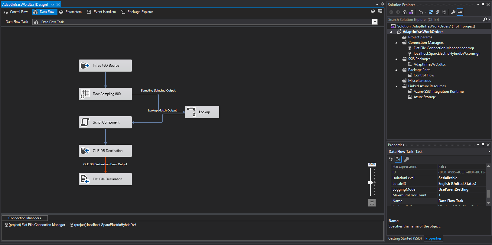

[Back to Main Page](index.md)   
[Go To Technical and Entity Information](technical.md)  

---

### Creation of the Test-bed:

>Having worked in the Utility sector, I created the tables with that knowledge, along with an awareness of the current changes the power industry now faces.

---

###SSMS:
The initial setup files are T-SQL. They require access and authority to run SSMS scripts, or to run scripts against a database server in which the user has authority to create a database, and perform CRUD operations. (along with alter and drop)  

__Run the six-part segmented script as follows:__

> 01A_CREATE_SparcElectricDW.sql  
This sets up the basic underlying database and sets some parameters and configuration for it.

> 02A_CREATE_TABLES_SparcElectricDW.sql  
[script](https://github.com/GraceLoggins/SparcElectric/blob/site/database%20scripts/02A_CREATE_TABLES_SparcElectricDW.sql)  
This creates the tables.

> 03A_FILL_BASE_TABLES_SparcElectricDW.sql  
This enters base data into the database like Customers, Employees, MeterModels, ConnectionTypes, and employee WorkSkills and their relationship to the employee in EmployeeSkills. It also loads a set of SparcElectric infrastructure types in InfrasType and inventory in Inventory.

> 04A_ADD_FOREIGN_KEYS_ETC.sql  
Adds the relationships between the tables as a set of foreign keys with constraints.

> 05A_ADD_STORED_PROCS.sql  
[script](https://github.com/GraceLoggins/SparcElectric/blob/site/database%20scripts/05A_ADD_STORED_PROCS.sql)  
Adds the two stored procedures sparc_ProcessCustWOintoDW and sparc_ProcessInfrasWOintoDW, which are used after the SSIS packages are run, to collect up the SparcWONumbers into the fact tables.

> 06A_ADD_DATE_DIMENSION.sql  
Runs all the necessary code to insert and complete a date dimension for the database.
    Uses a CTE and additional alterations to set up a convenient data dimension.
    The date dimension is specific to the dates 2018 - 2022 and will be updated to allow generation of other date ranges in future.

---


### SSIS:
Now that the database is initialized and ready for the Work Orders to be generated, we switch to Visual Studio with SSDT installed to run the SSIS packages. The SSIS packages I created are run against the newly created and filled base tables, and use some randomization (between limits) to create the work orders.  

__Run, in order, the following SSIS packages:__


> CreateWorkOrders  
Inserts to both WOCustomer and WOInfras tables (affecting the work orders for the Customer 
and the Inventory entities)
    Generates basic work orders for both customer (one one branch) and infrastructure (on the other branch). 
    Generates one work order for each SparcWONumber (SparcElectric work order number).
    Currently uses random dates and employee assignments for the generated work orders.
        Some possible future updates:
            - Make certain an employee does not appear to work in two places at the same time, and provide 10 minutes travel time between customer locations.
            - Have employees with the appropriate work skills work only the orders which they are qualified for (currently the assignments are random).


> AdaptWorkOrders  
Inserts to the WOCustomer table, providing several variations added to a SparcWONumber 
(only affecting the work orders for the Customer entity)
    Generates additional work orders for randomly selected SparcWONumbers, so that an employee 'works' a single SparcWONumber on multiple contiguous days. Provides a slightly less simplistic base of work orders to play with.


> AdaptInfrasWorkOrders  
Iinserts to the WOInfras table, providing several variations added to a SparcWONumber
(only affecting the work orders for the Inventory entity)  
Generates additional work orders for randomly selected SparcWONumbers, so that an employee 'works' a single SparcWONumber on multiple contiguous days. Provides a slightly less simplistic base of work orders to play with.

---

### SSMS:

The final steps use stored procedures I wrote to accumulate the work orders, adding some additional information required by the inquiry, and removing fields that are invalid in aggregation. They write the records produced to the fact tables.

__After running the SSIS packages, we skip back to SSMS to run the procedures we installed previously. From SSMS query: __


```
USE SparcElectricHybridDW;
GO
EXEC dbo.sparc_ProcessCustWOintoDW;
```

```
USE SparcElectricHybridDW;
GO
EXEC dbo.sparc_ProcessInfrasWOintoDW;
```

Note:
If there is difficulty during the initial load while running either of the sparc_Process stored procedures, remember to set the DWProc field to 0 (indicating a processed record) before running it again.
```
UPDATE WOCustomer SET DWProc = 0;
UPDATE WOInfras SET DWProc = 0; 
UPDATE WorkOrderCustFact SET DWProc = 0;
UPDATE WorkOrderInfrasFact SET DWProc = 0;
```

The DWProc field indicates that the record has been processed, so that subsequent runs against the WOCustomer or WOInfras tables do not count a particular work order record more than once.


The demo is now set up, and sample work orders have been generated to use with the accompanying Power BI reports.

[Back to Main Page](index.md)  
[Go To Technical and Entity Information](technical.md)


